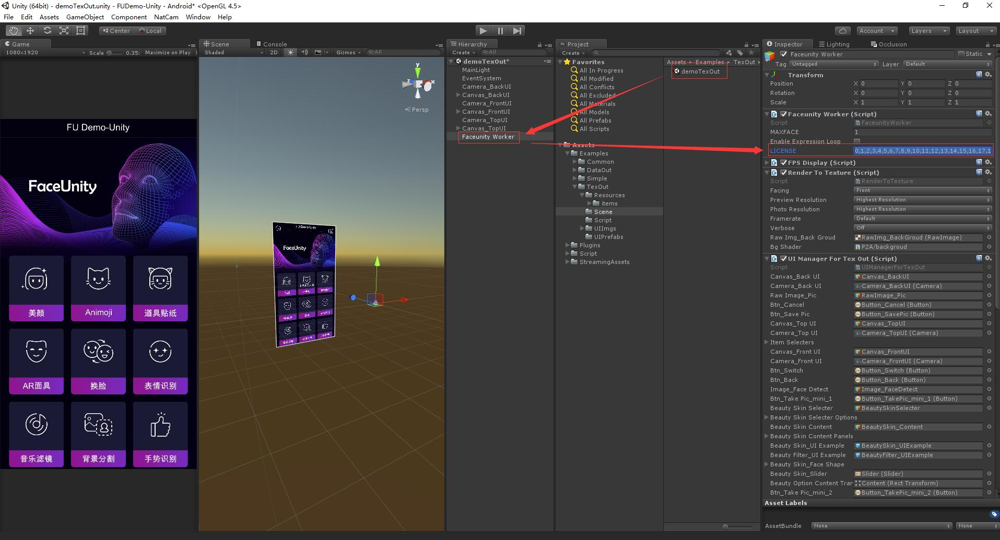

# Unity Nama SDK Integration Guide  


## Updates：

2021-11-15 v8.0.0：

1. The beauty props part of the interface has changed, please note the synchronization code
2. Please refer to this document and code comments for tongue tracking
3. anim_model.bytes and ardata_ex.bytes are abandoned，Please delete the relevant data and code

------
## Contents：
[TOC]

------
## 1. Introduction 
This document shows you how to integrate the Faceunity Nama SDK into your Unity project.   

------


## 2. File structure

This section describes the structure of the Demo file, the various directories, and the functions of important files.

```
+FULiveUnity
  +Assets 			  	//Unity resource 
    +Examples				//example directory
      +Common					//common resource 
      	+Materials：common materials
        +Script：script
        +Shader：Shader used to render the model, for reference only.
        +Textures：the Logo for demo
        +UIImgs：Some public UI images。
      +DataOut					// FacePlugin's data output mode, using Unity for content rendering, uses NativeCamera to improve efficiency. Only the position, rotation, expression coefficients, etc. of the face are output for Unity rendering.
      	+Models: The human head model and the corresponding material texture.
      	+Scene: Demo scene，demoDataOut is a human head model rendering, and demoDataOut_Multiple is a multiplayer model rendering.
      	+Script: some script of demo.
		 -RenderToModel.cs: Responsible for docking the camera plug-in, inputting and outputting image data, and managing the rotation scaling of the output texture.
		 -StdController.cs: Responsible for controlling the position, rotation and expression coefficient of the human head.
		 -EyeController.cs: Responsible for controlling the position and rotation of the eye.
		 -UIManagerForDataOut.cs: UI controller for the DataOut scene.
		 -UIManagerForDataOut_Multiple.cs: The UI controller of the DataOut_Multiple scene is also responsible for multi-person model scheduling.
      +Simple					//The simplest use case for FacePlugin, directly using Unity's own WebCamTexture to simplify the code structure.
       +Scene: demoSimple
	   +Script: some script of demo.
		 -RenderSimple.cs: If you need to enter image data obtained by other channels, please refer to this function.
		 -UIManagerSimple.cs: The UI controller of the simple scene, registered the switch camera button, manages the face detection flag.
      +TexOut					//FacePlugin's texture output mode, using the Faceunity Nama SDK for content rendering, uses NativeCamera for efficiency. Directly output the data rendered by the plugin, you can use the attached binary props file.
      	+Resources: Binary files for all items and corresponding UI files.
	    +Scene: demoTexOut。
	    +Script: some script of demo.
		 -RenderToTexture.cs: Responsible for docking camera plug-ins, inputting and outputting image data, loading and unloading props.
		 -UIManagerForTexOut.cs: The UI controller for texture output mode works with RenderToTexture to show the functionality of all the props.
		 -ItemConfig.cs: A configuration file for information such as the binary file of the item and the path of the UI file.
    +Plugins				//SDK file directory
      +CNamaSDK             //NamaSDK file directory
      +NativeCamera         //NativeCamera file directory
    +Script					//Core code file directory
      -FaceunityWorker.cs：Responsible for initializing the faceunity plugin and introducing the C++ interface. After the  
       initialization is completed, the face tracking data is updated every frame.
      -BaseRender.cs:The parent class of RenderModel, RenderSimple, and RenderToTexture, responsible for docking camera plug-          ins, inputting and outputting image data, and loading and unloading props.
      -CameraManager.cs:Camera management
      -ICamera：The parent class of the camera
      -NativeCamera：Directly call the C++ camera interface to run the camera (mobile phones above Android7.0 support C++ to            directly call the Android camera)
      -LegacyCamera：Unity’s WebCamTexture runs the camera (mobile phones below Android 7.0, and some Android 7.0 above do not          support C++ to directly call the camera)
    +StreamingAssets		//data file directory
      -v3.bytes：SDK data file, the lack of this file will cause initialization failure
      -tongue.bytes：Tongue tracking necessary files
      -EnableTongueForUnity.bytes：In some cases, the file that needs to be loaded to get the tongue tracking data
  +docs					//doc 
  +ProjectSettings   	//Unity project config
  -readme.md			//readme
  
  
```

------
## 3. Integration


### 3.1 Develop environment
#### 3.1.1 Platform
```
Windows、Android、iOS（9.0 or above）、Mac
```
#### 3.1.2 Develop environment
```
Unity2018.4.23f31or above
```

### 3.2 Preparing 
- [download demo](https://github.com/Faceunity/FULiveUnity)
- Get certificates:
  1. call **0571-88069272** 	
  2. send mail to **marketing@faceunity.com** 

### 3.3 Configurations
- Copy the data in the certificate file to the LICENSE input box of the Inspector panel of the FaceunityWorker object in the scene, and save the scene (other scenes are the same).



- If you need to integrate this SDK into your project：
  1. Please copy all the files and folders except the Examples folder in the Assets folder of the demo to your project.
  2. Configure the rendering environment to be OpenGL.
  3. Create a new object in the scene, mount the FaceunityWorker component, and fill in the certificate information with reference to the above figure.
  4. Write your own code input component for image input.
  5. Refer to the demo to get the tracking data, or load the props for rendering.

### 3.4 initialization

View the object Faceunity Worker in the demoSimple scene. This object mounts 4 code components. The FaceunityWorker is a component that must be used in all scenarios that use this SDK. This component introduces all the interfaces of the SDK, initialization code, and each frame. Make a SDK-rendered coroutine (CallPluginAtEndOfFrames) and related code, leaving the component code sample code for this case.

At the beginning of each scene, FaceunityWorker will call DontDestroyOnLoad so that the host object is not destroyed when switching scenes, and ensure that there is only one instance of FaceunityWorker component in the scene. All the cases in this demo do not support switching scenarios. If there is a need, please make sure that this component is not destroyed when switching scenes, and there is only one component instance.

The SDK will be initialized in the Start function of FaceunityWorker. After the initialization is completed, the initialization completion event will be executed, and the coroutine (CallPluginAtEndOfFrames) of each frame for SDK rendering will be enabled. CallPluginAtEndOfFrames may stop running when you switch scenes, and you may need to call the related coroutine startup function again.

### 3.5 Input image data

This example uses the least code to run the SDK. To make this example work, initialize the camera directly in RenderSimple and input the image data returned by the camera. **If you want to enter your own image data, please refer to this case.

The most critical function in RenderSimple:

```c#
public void UpdateData(IntPtr ptr,int texid,int w,int h, UpdateDataMode mode)
```

This function shows how to enter image data into the plugin and how to retrieve the rendered data from the plugin.

```
    public enum UpdateDataMode
    {
       RGBABuffer,
       BGRABuffer,
       TexID,
       NV21Buffer,
       NV21BufferAndTexID,
       YUV420Buffer
    }
```

The above four UpdateDataModes are the four formats of the input image data of the SDK.

`NV21Buffer` : Buffer array in NV21 format, usually on Android devices, used by native camera plugins

`NV21BufferAndTexID`  : input the buffer array and texture ID in NV21 format, usually on Android devices, through the native camera plug-in, the most efficient

`RGBABuffer`: Buffer array in RGBA format, the most versatile, can be used on all platforms

`BGRABuffer`: Buffer array in BGRA format, the most versatile, can be used on all platforms

`TexID` : GL texture ID, which cannot be used in some special GL environments, but to some extent performance is higher than Image

`YUV420Buffer`:Usually used on Android devices through native camera plug-ins, NV21 is also a kind of YUV

```c#
public static extern int fu_SetRuningMode(int runningMode);
public enum FURuningMode
    {
        FU_Mode_None = 0,
        FU_Mode_RenderItems, 
        FU_Mode_Beautification,
        FU_Mode_Masked, 
        FU_Mode_TrackFace
    };
```

fu_SetRuningMode can set the running mode of the plug-in, and setting the running mode for the demand can greatly improve the efficiency. FU_Mode_RenderItems is the default mode of operation. You can change the initial value yourself in FaceunityWorker.cs or change it at runtime. Please see the API documentation for specific effects.

refer to the BaseRenerder.

In the demoDataOut and demoTexOut scenes, NativeCamera is used to accelerate the video function. At the same time, it is necessary to handle the video rotation mirroring, so the data input process is more complicated.

***UNITY_ANDROID：*** 

In RenderSimple/RenderToModel/RenderToTexture, NativeCamra will be turned on during initialization, and NativeCamra will get the camera data in the C++ layer and directly input the data to this SDK. When outputting, please handle mirror rotation and scaling by yourself.

***UNITY_IOS:：*** 

The initialization steps are the same as ANDROID, NativeCamra will get the camera data in the C++ layer and directly input the data to this SDK. However, the plug-in in the IOS environment automatically handles mirroring and rotation during output, and only needs to handle scaling after output.

### 3.6 Output tracking data

In the demoDataOut scene, click TrackPositon on the UI to switch the rendering mode. Click on the ide Icon to switch the model.

After the initialization is completed, FaceunityWorker will update the face tracking data in CallPluginAtEndOfFrames called every frame (if EnableExpressionLoop is true), each data of each face is stored in the form of CFaceUnityCoefficientSet, when the outside world needs to obtain data only You need to directly call this class instance corresponding to this data. For details, refer to StdController and EyeController in this scenario.

**demoDataOut scene：** 

StdController obtains rotation and expression data in each frame through the address pre-stored in FaceunityWorker, and sets the model corresponding parameters according to the image condition. The emoticon data contains 56 blendshape values, combined with a pre-made model with 56 blendshapes, set using SkinnedMeshRenderer.SetBlendShapeWeight.

EyeController obtains the rotation data of the eye in each frame through the address pre-stored in FaceunityWorker, and sets the eye rotation according to the mirror condition.

Click TrackPositon on the UI to enable/disable position tracking while switching RuningMode. When TrackPositon is turned on, the running mode is set to FU_Mode_RenderItems, and the camera image is rendered to the UI. When off, set the run mode to FU_Mode_TrackFace and turn off image rendering to improve performance.

**demoDataOut_Multiple scene：** 

The multiplayer version of the demoDataOut scene AR mode (with TrackPositon enabled), setting MAXFACE in the Inspector of the Faceunity Worker object in the scene can modify the maximum number of faces to be tracked at the same time.

**About tongue tracking：**

1.Must load tongue.bytes

2.In the Texout scene, an item with a tongue function, such as a frog, can be displayed to show the tongue tracking effect.

3.In the Dataout scenario, when FURuningMode is FU_Mode_RenderItems, EnableTongueForUnity.bytes is loaded to enable tongue tracking. When FURuningMode is FU_Mode_TrackFace, fu_SetTongueTracking(1) is called to enable tongue tracking. Note that you need to set it once after switching to FU_Mode_TrackFace! ! !

### 3.7 Output image data

In the demoTexOut scene, RenderToTexture(Inherited from baseRenerder) is mounted. This component is not only responsible for controlling the camera and inputting image data, but also encapsulating some of the props loading and unloading interfaces. If you don't know the native props interface and related features, you can refer to this case. .

```c#
public IEnumerator LoadItem(Item item, int slotid = 0, LoadItemCallback cb=null)
```

This interface encapsulates the loading and enabling of the props, while using the concept of slot to control the use of multiple props.

```c#
int[] itemid_tosdk;
GCHandle itemid_handle;
IntPtr p_itemsid;
```

Itemid_tosdk is the slot array, which holds the itemid that each slot needs to render. If it is 0 or other invalid ids will be skipped, don't worry about entering the wrong data.

```c#
var bundledata = Resources.LoadAsync<TextAsset>(item.fullname);
yield return FaceunityWorker.fu_CreateItemFromPackage(pObject, bundle_bytes.Length);
int itemid = FaceunityWorker.fu_getItemIdxFromPackage();
UnLoadItem(slotid); //Unload the last item in this slot
FaceunityWorker.fu_setItemIds(p_itemsid, SLOTLENGTH, IntPtr.Zero);
```

The five lines of code constitute the main function of this interface (here is only pseudo code), the first line calls the unity IO interface to read the prop file, the second line calls fu_CreateItemFromPackage to load the prop, this interface is a coroutine, which internally calls the native interface. After loading the item, it will not take effect immediately, so it will wait for two frames until the item is actually loaded, and then the third line of code will get the itemid of the item that has just been loaded, because the loaded item will not be directly rendered. To use the slot array, the fourth line first unloads the Nth item in the slot array, and then fills the itemid just obtained into the Nth position of the slot array. The fifth line sets all the items that are actually rendered next.

------
## 4. Function
Items other than special files such as v3.bytes and tongue.bytes (*.bytes or *.bundle) can be loaded directly using LoadItem or native interface.

The following function modules can be loaded using this method. The following only describes the parameters unique to the corresponding item.

```c#
//Rtt is an instance of RenderToTexture, this is the packaged loading method in the actual code.
yield return rtt.LoadItem(ItemConfig.beautySkin[0], (int)SlotForItems.Beauty);


var bundledata = Resources.LoadAsync<TextAsset>(itempath);
yield return bundledata;
var data = bundledata.asset as TextAsset;
byte[] bundle_bytes = data != null ? data.bytes : null;
GCHandle hObject = GCHandle.Alloc(bundle_bytes, GCHandleType.Pinned);
IntPtr pObject = hObject.AddrOfPinnedObject();
yield return FaceunityWorker.fu_CreateItemFromPackage(pObject, bundle_bytes.Length);
hObject.Free();
int itemid = FaceunityWorker.fu_getItemIdxFromPackage();
var itemid_tosdk = new int[1];
var itemid_handle = GCHandle.Alloc(itemid_tosdk, GCHandleType.Pinned);
var p_itemsid = itemid_handle.AddrOfPinnedObject();
FaceunityWorker.fu_setItemIds(p_itemsid, 1, IntPtr.Zero);
```

### 4.1 Video beautification

please refer to[Beautification Filters User Specification](Beautification_Filters_User_Specification.md)。

### 4.2 Animoji

```c#
yield return rtt.LoadItem(ItemConfig.item_1[0], (int)SlotForItems.Item);
```

Animoji does not track face position when rendering by default, but can turn on tracking and background image display by turning on AR mode:

```c#
rtt.SetItemParamd(item.name, "{\"thing\":\"<global>\",\"param\":\"follow\"}", 1);
```

Mirror related parameters：

```c#
//is3DFlipH mirror the vertex of the 3D prop
FaceunityWorker.fu_ItemSetParamd(itemid, "is3DFlipH", param);
//isFlipExpr mirror the expression coefficients inside the item.
FaceunityWorker.fu_ItemSetParamd(itemid, "isFlipExpr", param);
//isFlipTrack The parameter is a mirror image used to rotate the face tracking position of the item.
FaceunityWorker.fu_ItemSetParamd(itemid, "isFlipTrack", param);
//isFlipLight The parameter is used to mirror the light inside the item.
FaceunityWorker.fu_ItemSetParamd(itemid, "isFlipLight", param);
```

The default face recognition direction will affect the default direction of Animoji：

```c#
FaceunityWorker.fu_SetDefaultRotationMode(3);
```

### 4.3 Comic Filter

```c#
yield return rtt.LoadItem(ItemConfig.commonFilter[0], (int)SlotForItems.CommonFilter);
```

Set parameters to switch filter style

```c#
rtt.SetItemParamd((int)SlotForItems.CommonFilter, "style", 0);
//You can try setting an integer other than 0.
```

### 4.4 AR mesh

```c#
yield return rtt.LoadItem(ItemConfig.item_3[0], (int)SlotForItems.Item);
```

### 4.5 Background segmentation

```c#
yield return rtt.LoadItem(ItemConfig.item_7[0], (int)SlotForItems.Item);
```

### 4.6 Face Transfer

```c#
yield return rtt.LoadItem(ItemConfig.item_4[0], (int)SlotForItems.Item);
```

### 4.7 Expression recognition

```c#
yield return rtt.LoadItem(ItemConfig.item_5[0], (int)SlotForItems.Item);
```

### 4.8 Gesture Recognition

```c#
yield return rtt.LoadItem(ItemConfig.item_8[0], (int)SlotForItems.Item);
```

The rotation mirror parameter of gesture recognition is unique：

```c#
//rotMode is the direction of the gesture
FaceunityWorker.fu_ItemSetParamd(itemid, "rotMode", 2);
//Loc_x_flip for rendering X-axis mirroring
FaceunityWorker.fu_ItemSetParamd(itemid, "loc_x_flip", 1.0);
```

### 4.9 Stickers

```c#
yield return rtt.LoadItem(ItemConfig.item_2[0], (int)SlotForItems.Item);
```

### 4.10 Face Warp

```c#
yield return rtt.LoadItem(ItemConfig.item_9[0], (int)SlotForItems.Item);
```

### 4.11 Music filter

```c#
yield return rtt.LoadItem(ItemConfig.item_6[0], (int)SlotForItems.Item);
```


```c#
rtt.SetItemParamd(name, "music_time", audios.time * 1000);
```

### 4.12 Dynamic Portrait Function

```c#
yield return rtt.LoadItem(ItemConfig.item_11[0], (int)SlotForItems.Item);
```

### 4.13 Light Makeup

```c#
yield return rtt.LoadItem(ItemConfig.makeup[0], (int)SlotForItems.Makeup);
```

The calling method of this prop is relatively complicated.：

```c#
rtt.SetItemParamd((int)SlotForItems.Makeup, "is_makeup_on", 1);
rtt.SetItemParamd((int)SlotForItems.Makeup, "makeup_intensity", makeupitem.intensity);
                
rtt.SetItemParamdv((int)SlotForItems.Makeup, "makeup_lip_color", makeupitem.Lipstick_color);
rtt.SetItemParamd((int)SlotForItems.Makeup, "makeup_intensity_lip", makeupitem.Lipstick_intensity);
rtt.SetItemParamd((int)SlotForItems.Makeup, "makeup_lip_mask", 1.0);
 
CreateTexForItem(uisprites.GetTexture(MakeupType.Blush, makeupitem.Blush_id), "tex_blusher");
rtt.SetItemParamd((int)SlotForItems.Makeup, "makeup_intensity_blusher", makeupitem.Blush_intensity);
 
CreateTexForItem(uisprites.GetTexture(MakeupType.Eyebrow, makeupitem.Eyebrow_id), "tex_brow");
rtt.SetItemParamd((int)SlotForItems.Makeup, "makeup_intensity_eyeBrow", makeupitem.Eyebrow_intensity);
 
CreateTexForItem(uisprites.GetTexture(MakeupType.Eyeshadow, makeupitem.Eyeshadow_id), "tex_eye");
rtt.SetItemParamd((int)SlotForItems.Makeup, "makeup_intensity_eye", makeupitem.Eyeshadow_intensity);
```


------
## 5. FAQ 

### 5.1 about compile

- Please select 9.0 or higher system version when compiling iOS.
- **Since Github does not support uploading files larger than 100MB, the iOS library is compressed, please decompress it yourself!**
- The Unity project import may cause the platform information of some native libraries to be lost. If the error is not found when running or compiling, please manually modify the platform information of the corresponding library. The native libraries in this case are:
  - Assets\Plugins
    - 

### 5.2 About mirroring / rotation
The concept of mirroring/rotation throughout the project has been mentioned many times in several places. Here we explain the concept of mirroring/rotation in different places.
#### 5.2.1 Input image data mirroring / rotation
If you are entering a texture ID, you can calculate the image rendering parameters yourself and then enter the SDK, which is logically more convenient.

```c#
//Flip the input texture, only valid for Android platforms that use NativeCamera
//NativeCamera's Android platform uses SetDualInput. Some Android platforms nv21buf and tex have inconsistent directions. You can use this interface to set the tex image.
public static extern int SetFlipTexMarkX(bool mark);
public static extern int SetFlipTexMarkY(bool mark);
```

#### 5.2.2 Mirroring/rotating of tracking data

The mirroring of the tracking data is post-processing and control is in your hands. Refer to StdController and EyeController.

```c#
//Mirroring the table for Blendshape parameters
mirrorBlendShape
//Mirror tracking rotation and displacement
m_rotation
m_translation
//Mirroring AR mode rotation parameters
m_rotation_mode
//Mirror eye rotation
pupil_pos
```
#### 5.2.3 Mirror rendering/rotation of prop rendering
The mirrored rotation of the item is controlled by the following parameters, or some unique parameters.

```c#
//flags: FU_ADM_FLAG_FLIP_X = 32;
//		 FU_ADM_FLAG_FLIP_Y = 64; 
//Flip only flips 2D prop rendering and does not flip the entire image
FaceunityWorker.SetImage(ptr, flags, false, w, h);

//is3DFlipH mirror the vertex of the 3D prop
FaceunityWorker.fu_ItemSetParamd(itemid, "is3DFlipH", param);
//isFlipExpr mirror the expression coefficients inside the item.
FaceunityWorker.fu_ItemSetParamd(itemid, "isFlipExpr", param);
//isFlipTrack The parameter is a mirror image used to rotate the face tracking position of the item.
FaceunityWorker.fu_ItemSetParamd(itemid, "isFlipTrack", param);
//isFlipLight The parameter is used to mirror the light inside the item.
FaceunityWorker.fu_ItemSetParamd(itemid, "isFlipLight", param);
```

#### 5.2.3 Mirroring/rotating of the output image

```c#
//The mirror/rotation of the output image is post-processing. Refer to this function to adjust the UI.
public void SelfAdjusSize();
//Or refer to this adjustment texture
public Texture2D AdjustTex(Texture2D tex_origin,int SwichXY, int flipx, int flipy);
```
